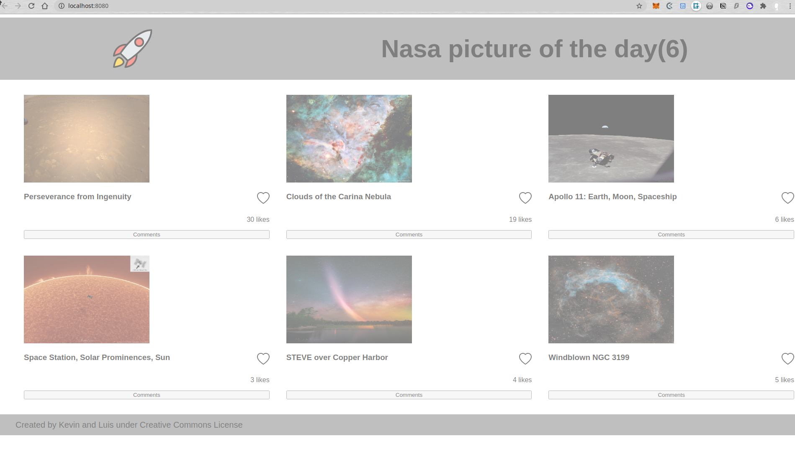

# Project Name

JavaScript capstone project - An API-based webapp

The webapp loads images from the NASA - Astronompy Picture of the Day API.
Users can add comments or like the image.

## Built With

- JavaScript, HTML, CSS
- Webpack
- Asynchronous javascript, promises, DOM manipulation

## Live Demo

[Live Demo Link](https://livedemo.com)

## Getting Started

To get a local copy up and running follow these simple example steps.

### Prerequisites
- Node
- Web browser

### Setup
- Open terminal porgram
- Clone this repositiory by running `git clone https://github.com/LOctavio/JavaScript-capstone.git `

### Install
- Run `npm install`

### Usage
- Run `npm start`

### Run tests
- Run `npm run tests`

## Authors

 **Luis Octavio Ramirez Cruz** 
 - GitHub: [LOctavio](https://github.com/LOctavio) 
 - Twitter: [@Octavio_ram431](https://twitter.com/Octavio_ram431)
  - LinkedIn: [Luis Octavio Ramirez Cruz](https://www.linkedin.com/in/luis-octavio-ramirez-cruz/) 

**Kevin Kamau**
- Github: [@kimothokamau](https://github.com/kimothokamau)
- Twitter: [@kimothokk](https://twitter.com/kimothokk)
- Linkedin: [Kevin Kamau](https://www.linkedin.com/in/kevinkamauk/)

## 🤝 Contributing

Contributions, issues and feature requests are welcome!

Feel free to check the [issues page](https://github.com/LOctavio/JavaScript-capstone/issues)

## Show your support

Give a ⭐️ if you like this project!

## 📝 License

This project is [MIT](lic.url) licensed.
